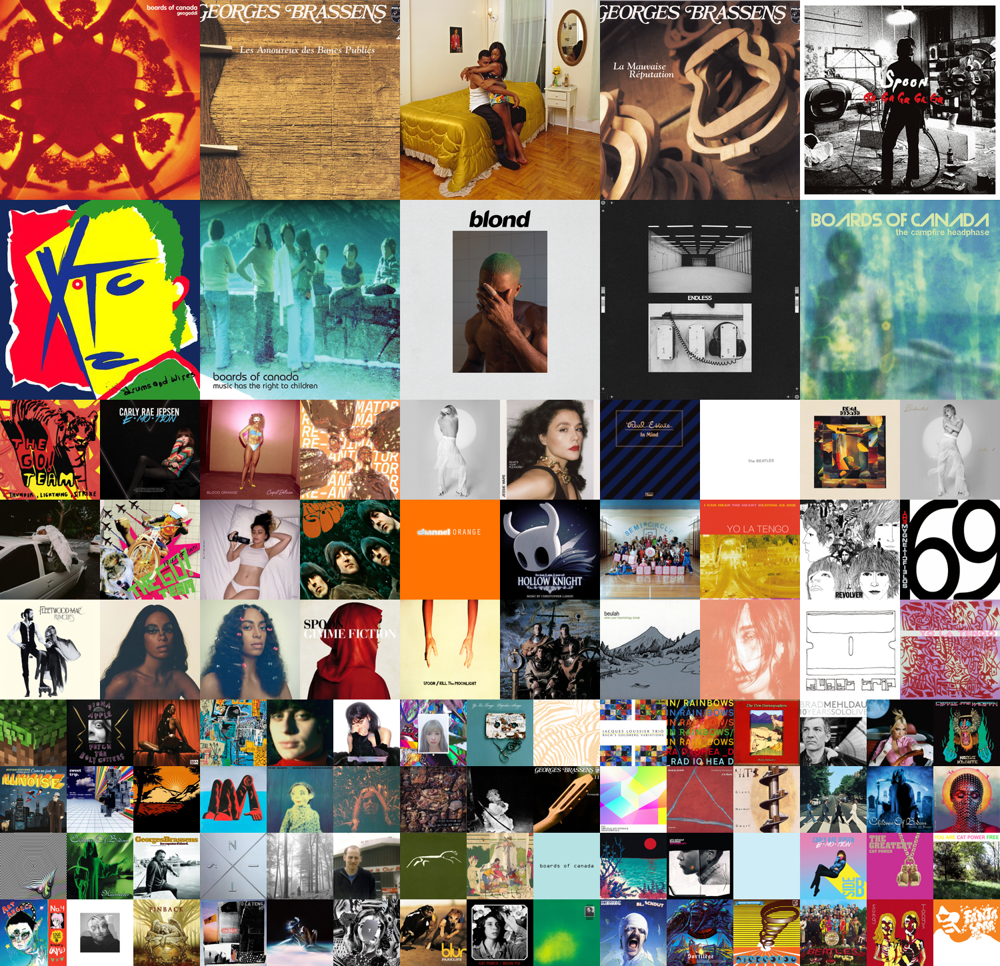

# lastfm_cg : lastfm collage generator

[](https://app.codacy.com/app/dbeley/lastfm_cg?utm_source=github.com&utm_medium=referral&utm_content=dbeley/lastfm_cg&utm_campaign=Badge_Grade_Dashboard)

[](https://codecov.io/gh/dbeley/lastfm_cg)

<a href="docs/1month_2x3.png"></a>

Generate album collage from a lastfm user history.

This utility needs a valid config file with your lastfm API keys (get them at [last.fm/api](https://www.last.fm/api).) in `~/.config/lastfm_cg/config.ini` (the config file will be created at first launch, you can also see `config_sample.ini` for an example).
 You can also use the `--API_KEY` and `--API_SECRET` argument to set your lastfm API key.

A twitter bot and a mastodon bot are also available in the bot_lastfm_cg folder. You can see them in action on my own [Twitter](https://www.twitter.com/d_beley) and [Mastodon](https://mamot.fr/web/accounts/79776) accounts.

Some systemd service are also available in the systemd-service directory to run the lastfm_cg script at a given time (more information below).

## Requirements

- pylast
- numpy
- pillow
- requests
- tqdm

## Installation

Classic installation :

```
pip install lastfm_cg
```

If you are an Archlinux user, you can install the AUR package [lastfm_cg-git](https://aur.archlinux.org/packages/lastfm_cg-git).

### Run from source

```
git clone https://github.com/dbeley/lastfm_cg
cd lastfm_cg
python setup.py install
lastfm_cg -h
```

## Usage

Show the help and the available options.

```
lastfm_cg -h
```

```
usage: lastfm_cg [-h] [--debug] [--timeframe TIMEFRAME] [--rows ROWS]
                 [--columns COLUMNS] [--username USERNAME] [--top100]
                 [--API_KEY API_KEY] [--API_SECRET API_SECRET]
                 [--output_filename OUTPUT_FILENAME]

Create lastfm album collage for one or several lastfm users.

optional arguments:
  -h, --help            show this help message and exit
  --debug               Display debugging information
  --timeframe TIMEFRAME, -t TIMEFRAME
                        Timeframe (Accepted values : 7day, 1month, 3month,
                        6month, 12month, overall. Default : 7day).
  --rows ROWS, -r ROWS  Number of rows (Default : 5).
  --columns COLUMNS, -c COLUMNS
                        Number of columns (Default : number of rows).
  --username USERNAME, -u USERNAME
                        Usernames to extract, separated by comma.
  --top100              Create a top 100 image. Will override columns/rows.
  --API_KEY API_KEY     Lastfm API key (optional)
  --API_SECRET API_SECRET
                        Lastfm API secret (optional)
  --output_filename OUTPUT_FILENAME
                        Output filename (optional, example: output.png)
```

Generate a collage for the user USER of the size 5x5 for the last 7 days (default values).

```
lastfm_cg -u USER
lastfm_cg -u USER -t 7day -r 5
```

Generate a collage for the user USER of the size 10x8 for the last year.

```
lastfm_cg -u USER -t 12month -r 10 -c 8
```

Generate a top 100 collage for the user USER for all its listening history.

```
lastfm_cg -u USER --top100 -t overall
```

Generate collages for the users USER and USER2 of the size 3x30 for all their listening history.

```
lastfm_cg -u USER,USER2 -t overall -r 3 -c 30
lastfm_cg --username USER,USER2 --rows 3 --columns 30 --timeframe overall
```

## Sample results

### 5 rows x 8 columns

<a href="docs/overall_5x8.png"></a>

### Top 100

<a href="docs/12month_top100.png"></a>

## Systemd service

You will have to change the command executed with the systemd service (`ExecStart` option) and the working directory (`WorkingDirectory` option).

```
cp systemd-service/* ~/.config/systemd/user/
systemctl --user daemon-reload
systemctl --user enable --now lastfm_cg_weekly.timer
```
